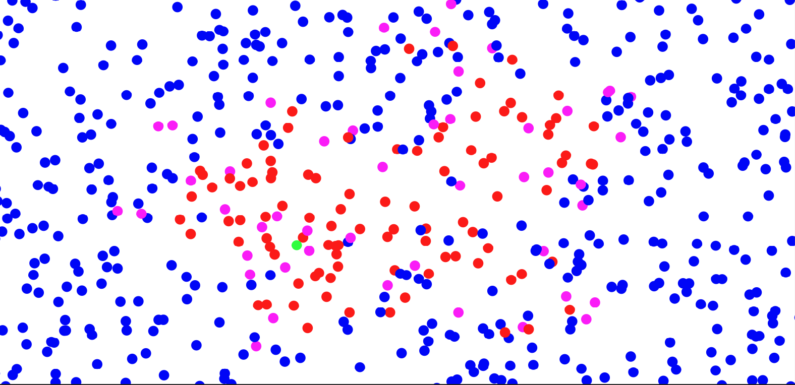

# COVID-19 Agent-Based Model

[](./Covid19AgentBasedModel.pdf)

<p align="center">
  
</p>

This repository contains a agent-based model for simulating COVID-19 transmission in a moving population. The implementation is centered on a spatial SEIR-style process with reinfection, optional interventions, and parameter sweeps for repeated experiments.

The code accompanies the paper _An Agent Based Model on Covid-19 Transmission Dynamics_ by [Wenqing Wang](https://wenqing-wang.netlify.app/).

## Quick start

If you already have the required jars available, the shortest path is:

1. Download MASON from the official site: <https://people.cs.gmu.edu/~eclab/projects/mason/>.
2. Add `mason.22.jar` to your Java project's classpath.
3. Add the MASON support libraries from the same page if you want charts, PDF export, or movie output.
4. Add the extra non-core jars or source folders that provide `sweep.*`, `spaces.*`, `groups.*`, `observer.*`, and `randomWalker.*`.
5. Import this repository as a Java project and mark `src/` as a source folder.
6. Set the working directory to the repository root so `runTimeFile.txt` can find `script.txt`.
7. Run `NetworkModel.GUICN`.

If you only add `mason.22.jar`, the `sim.*` imports will resolve, but this project still will not compile until the additional non-core packages above are also on the classpath.

## Install MASON

According to the official MASON page, the current binary distribution is `mason.22.jar`:

- Download `mason.22.jar` from <https://people.cs.gmu.edu/~eclab/projects/mason/>.
- Add it to your classpath.
- Download the support libraries linked on the same page and add those jars too if you need MASON to generate movies, charts, or PDF files.
- Download the MASON manual from the same page if you want the full setup and tutorial documentation.

For 3D simulations, the MASON page says you also need Java3D 1.6 libraries:

- `j3dcore.jar`
- `j3dutils.jar`
- `vecmath.jar`
- `jogamp-fat.jar`

This repository appears to use a 2D continuous-space GUI, so the 3D libraries are not the first thing to install unless your local setup specifically requires them.

## What the model simulates

Each agent moves in a 2D continuous space and occupies one of five disease states:

- `Susceptible`
- `Exposed`
- `Infectious`
- `Recovered`
- `Dead`

The main progression is:

1. Susceptible agents check nearby neighbors within an infection radius.
2. Exposure probability depends on contact context and agent attributes.
3. Exposed agents become infectious after a countdown.
4. Infectious agents either recover or die, with different death rates for elder agents.
5. Recovered agents return to `Susceptible`, so reinfection is possible.

## Built-in mechanisms

The current code supports the following features:

- Spatial movement with either uniform or Gaussian steps.
- Family-group contacts through `Groups.FAMILY`, with separate exposure probabilities for family vs. non-family interactions.
- Mask use and social approval dynamics.
- Testing and quarantine.
- Vaccination with two-dose logic and delayed effect.
- Mutation-driven increases in exposure probability.
- Optional network visualization for family-group links.

## Repository layout

- `src/NetworkModel/Environment.java`: simulation state, parameters, agent creation, and run startup.
- `src/NetworkModel/Agent.java`: agent behavior, movement, infection logic, vaccination, testing, and state transitions.
- `src/NetworkModel/GUICN.java`: GUI entry point.
- `src/NetworkModel/Experimenter.java`: periodic data collection for simulation outputs.
- `script.txt`: parameter sweep script and default runtime parameters.
- `runTimeFile.txt`: runtime config for script name, output folder, output file, and column headers.
- `Covid19AgentBasedModel.pdf`: paper associated with the model.
- `figs/`: exported figures and example outputs.

## Running the model

This repository does not include Gradle, Maven, or Ant build files, and it does not vendor its Java dependencies. The project is set up like an IDE-managed Java project that expects external simulation libraries on the classpath.

To run it:

1. Import the repository as a Java project in your IDE, or compile it manually with an explicit classpath.
2. Add `mason.22.jar` plus any required MASON support libraries from the official MASON site: <https://people.cs.gmu.edu/~eclab/projects/mason/>.
3. Add the external libraries or source folders that provide the non-core imports used here: `sweep.*`, `spaces.*`, `groups.*`, `observer.*`, and `randomWalker.*`.
4. Ensure the `sim.*` imports resolve from MASON and the remaining imports resolve from your companion library set.
5. Use the repository root as the working directory so `runTimeFile.txt` can resolve `script.txt`.
6. Launch `NetworkModel.GUICN`.

The GUI entry point is:

```java
src/NetworkModel/GUICN.java
```

Its `main` method initializes:

- `Environment` as the simulation state
- `Experimenter` as the observer / data collector
- `GUICN` as the visualization layer

## Configuration

Two root-level files drive most runs:

- `runTimeFile.txt`
- `script.txt`

`runTimeFile.txt` selects the sweep script, output location, output file name, precision, and output columns.

`script.txt` defines the simulation parameters. It also supports parameter sweeps: the first three parameters with multiple comma-separated values are expanded into a Cartesian product of experiment settings.

Example:

```java
public boolean testing = false, true;
```

Important parameters exposed in `script.txt` include:

- initial population counts: `susceptible`, `infected`
- interventions: `SocApproval`, `mutation`, `vaccine`, `testing`
- quarantine timing: `countdownTest`, `countdownQuarantine`
- vaccination behavior: `vaccineCoverage`, `elderFirst`
- run controls: `simLength`, `simNumber`, `dataSamplingInterval`
- output names: `fileDataName`, `folderDataName`

## Output data

`Experimenter` samples the simulation every `dataSamplingInterval` steps and writes the fields listed in `runTimeFile.txt`.

The default output columns are:

- `total`
- `susceptible`
- `exposed`
- `infected`
- `recovered`
- `dead`
- `wearMask`
- `expByFam`
- `expByNoneFam`

By default, `runTimeFile.txt` points results to:

```text
data/results.txt
```

## Current code behavior to know about

The README used to describe a nested project layout that is not present in this checkout. The actual repository is flat, with `src/`, `script.txt`, and `runTimeFile.txt` at the root.

Also, `Environment.start()` currently hardcodes the simulation space to a `200 x 200` continuous space:

- `gridWidth` and `gridHeight` are reset to `200`
- `spaces` is forced to `Spaces.CONTINUOUS`

That means the `gridWidth`, `gridHeight`, and `nameSpace` values in `script.txt` are not currently controlling the runtime space configuration.
